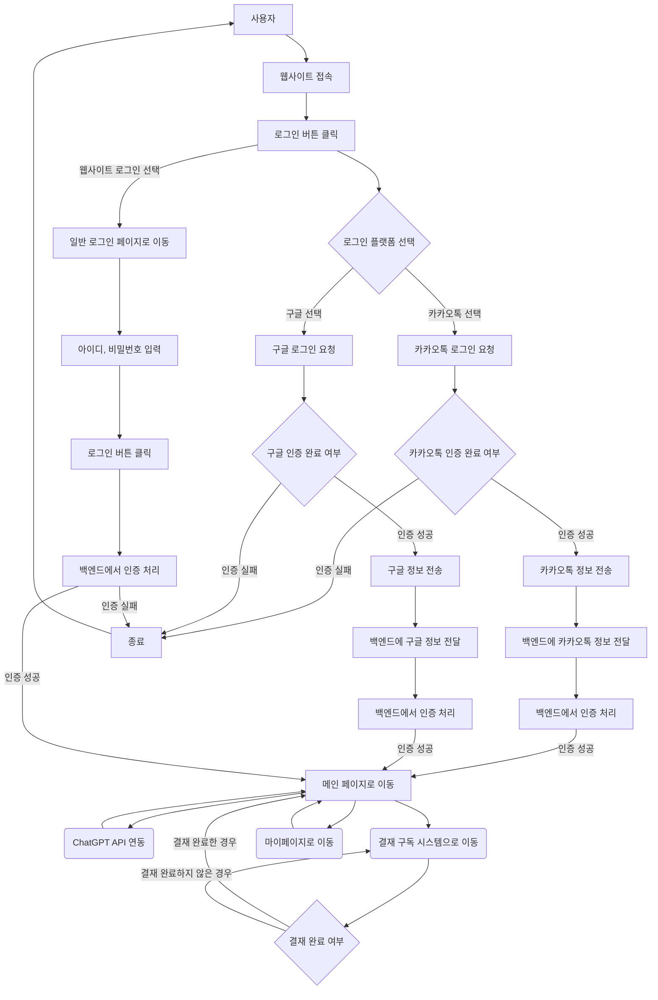

# 사용 폴더 내용

- config : 환경변수 정보 저장 (DB연결정보, API키값 등)

- public : 정적파일 관리 (JS, CSS, Image, Audio, Video 등)

- routes : 라우팅을 위한 폴더( 라우팅 별 모듈 생성/ 로직구현)

- views : 요청에 대한 로직 처리 후 응답을 보낼 html

- app.js 서버를 실행하기 위한 Main 파일(express 미들웨어 설정 )
  순두부 아니다 팀협업 테스트

# git 참고사항  
- .gitignore 사용법

1. node_module 지우고 다들 로컬에서 npm install 입력후 만듬

2. main 브랜치 에는 node_module 파일이 없어야한다.

3. 복잡하면 폴더를 전부삭제후 origon main branch에 .gitignore를 추가하고

4. 로컬에서 작업하던거 백업해놓고 클론다시받기

## 주의!

- 1. 브랜치 이동 주의

- 2. main origin 에는 node_modules가 없어야한다 (git 용량문제)

## 로그인 페이지 다이어그램

